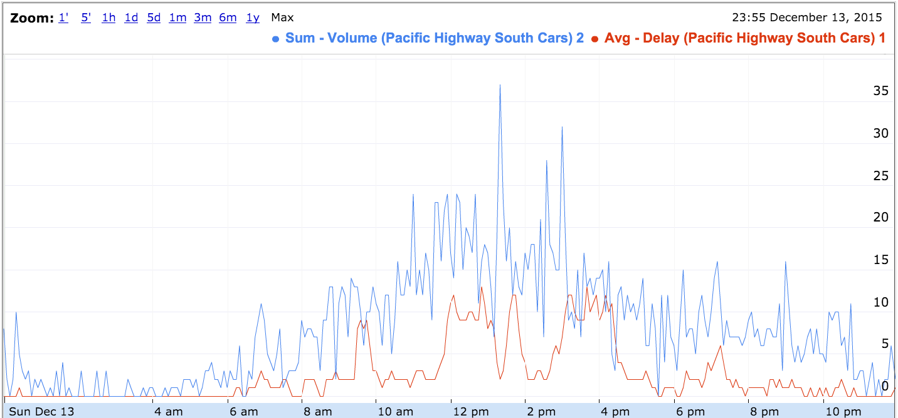

#Forecasting Wait Times at the US/Canada Border

## Background
Travel delays are a frustrating reality of driving and are particularly pronounced when crossing the US/Canada border.  Reliable and accurate predictions of wait times are not available to travelers.  This project predicts the wait times at the Peace Arch and Pacific Highway border crossings and provide users with a more reliable forecast of wait times for dates in 2016.

## Executive Summary
### Deliverables
* Model predictions of wait times for Peace Arch and Pacific Highway crossings
* Estimates for missing northbound data due to known sensor issues
* [Borderforecaster.com](http://borderforecaster.com) web app for displaying wait time predictions 

### Results
* Model predictions have better predictive accuracy than baseline model of 12 month averages by day of week
* The most important features are time of day and weather which capture daily and yearly seasonality, respectively
* The holidays that drive wait times differ based on travel direction, with most important holidays being Victoria Day and Good Friday

## Data Source
### JSON API
* [Whatcom Council of Governments](http://www.cascadegatewaydata.com/)
* 20+ million records of wait time and volume
* 5 minute grain
* Since 2007

### Crossings

* Peace Arch
* Pacific Highway
* Sumas
* Lynden

### Lanes

* Car
* Nexus
* Truck
* Bus
* FAST

*This project focused on car lane data at Peace Arch and Pacific Highway crossings only.*

## Goals
### Improve predictions compared to publicly available tools
Users can view real-time wait times from [WSDOT](http://www.wsdot.com/traffic/border/) or [US Customs](https://bwt.cbp.gov/), but the data is of limited value to those travelers already near the border.

Alternatively, users can view an average of wait times for a day of week from the [University of California](http://traffic.calit2.net/); however, variations by day of year are disregarded.

### Provide predictions for northbound crossings
The UC data only provides predictions for southbound crossings.  The reason for the omission is due to gaps in the data due to where the sensors are placed.  According to the data steward, data below a certain threshold are reported as zero.  

The chart below shows volume in red and wait time in blue.  Notice that between 12pm and 4pm, even though volume is at a peak, the wait time displays zero.

Compare this to southbound data which shows more reasonable wait times throughout the day.  Even when the wait time drops, rarely does it drop to zero.

## Pre-processing
### Imputing false zeros
For northbound data, the false zeros from chart above needed to be imputed before any predictions could be made.  The data was imputed using a decision tree model which used volume and wait time values of neighbors as features.  The imputer consisted of 3 separate decision tree models which were applied depending on whether values from neighbors were available:

* Both lead + lag values
* Lead values only
* Lag values only

Because of the large spans of false zeros, the imputer was applied iteratively, filling in missing values in step-wise fashion.

The imputer was trained on southbound data with data below a configurable threshold set to zero.  To validate the approach, the model was cross-validated on a separate southbound crossing where false zeros were emulated by removing data below a threshold.

### Smoothing and resampling
Due to the noise in the raw data, data was smoothed with a window size of 1 hour using LOWESS. 

Once smoothed, the data was resampled at 30 minute grain to reduce processing time without degrading the end-user experience.

## Feature Engineering
### Date and time features
For each record, the following date and time features were constructed:

* Time of day
* Year
* Month
* Week
* Day of week

### Holidays
Major holidays from US and Canada were added as features, along with lead and lag effects.  

Lead holiday features were added to account for traveler behavior ahead of a holiday, e.g., the Friday before Labor Day.  Lag holiday features were added to account for traveler behavior after a holiday, e.g. Sunday after Thanksgiving.

### Weather
Weather data was pulled from [Weather Underground](http://www.wunderground.com/) for Blaine, WA using following fields:

* Temperature (min/max/mean)
* Rain/Snow/Thunderstorm/Fog
* Precipitation

Lead and lag weather features were added to account for changes in traveler behavior after a weather event, or in anticipation of a weather event.

### Trend
Wait time has decreased over time as shown in chart below.

To model trend, a difference in daily average wait time was added as a feature.  Multiple difference features were included over multiple weeks to capture both long term and short term trends.  Note that each difference feature is quantized in 1 week intervals to account for weekly seasonality.

### Excluded features

| Feature | Why excluded | 
|---|---|
| School calendars | no improvement |
| Lag daily averages of wait times | overfit |
| Rolling daily averages of wait times | overfit |
| North vs. south volume imbalance | overfit |

## Modeling
### Baseline
A baseline model was defined as the average over the last 12 months by day of week.  The baseline is motivated by the day of week predictions referenced above from the University of California, and by predictions using Random Forest which tended to predict the same values as the baseline model.

Predictions from the baseline model served as measuring stick for comparing the quality of my model.

### Extra Trees
Random Forest was the first model attempted, but was never able to beat the baseline model.  A different decision tree model from scikitlearn, Extra Trees, was used instead yielding better results and more variance in prediction compared to the baseline.  

Once trend features were added to the model, Extra Trees consistently beat the baseline predictions for different crossings, directions and years.

A Gradient Boosting model was tested, but the predictive accuracy was only marginally better than Extra Trees.  The significantly higher processing cost of Gradient Boosting, due to the inability to parallelize model training, favored Extra Trees.

### Ensembling
To further improve the predictive accuracy, the Extra Trees predictions were ensembled with the baseline predictions. Ensembling was performed using a harmonic mean with equal weights.  

Different weights were attempted, but since optimal weights varied depending on the data set (year, crossing and direction), equal weights were used to better generalize the model.

### Preventing Overfitting
For any given data set, it was possible to improve the model via hyperparameter tuning.  However, this came at the expense of poorer predictive accuracy for a different data set, e.g. different year.

To keep the model generalizable, the Extra Trees model was loosely tuned with 96 estimators as the only non-default parameter.

### What about ARIMA?
There are a few factors that make ARIMA not applicable:

1. Multiple seasonalities, e.g. daily, weekly and yearly
2. Non-linear exogenous factors
3. Slow to train for large number of exogenous factors

An attempt at using ARIMA yielded predictions that repeated the same seasonal pattern without variation.

## Website

The website is a responsive site using Flask and Bootstrap.  For charting, the [Chartist](https://gionkunz.github.io/chartist-js/) javascript library was used.  Data is persisted in a postgreSQL database.  

Users can select a date, crossing location and direction to view intraday wait times.  For dates before 2016, predictions were generated on a weekly basis to emulate a production system where the model is retrained as new data is collected.

For dates from 2016 onwards, predictions were generated at one time to emulate long-term predictions.

The website is hosted on AWS at [http://borderforecaster.com](http://borderforecaster.com).

## Results
### R-squared
Below is a chart of R-squared calculated for predictions on Peace Arch southbound data.  The chart shows R-squared for both baseline and model when trained on a weekly or yearly basis.  When trained yearly, predictions for an entire year are generated all at once.  When trained weekly, predictions for the year are generated a week at a time with the model retrained for each week of predictions.

As should be expected, predictions trained weekly are better than predictions trained yearly.  In both cases, the model makes a better prediction than the baseline for each year.  The strength of the model is evidenced by the fact that ***the model when trained yearly beats the baseline when trained weekly*** for all years except 2015.

2015 shows the most dramatic improvements in R-squared due to the ability of the model to handle changes in trend.

### Feature importance

#### Overview

Time of day is the most important feature, corresponding to daily seasonality.

Weather is the second most important class of features, driven by temperature and precipitation features.  These likely act as a proxy for yearly seasonality corresponding to seasons of the year.  When weather features are scaled according to their frequency of occurrence, snow and thunderstorms stand out as the most important weather features.

#### Holidays

Differences between northbound and southbound crossings is most pronounced when comparing holiday features.  

Interestingly, the two holidays with highest importance are Canadian holidays - Victoria Day for northbound traffic and Good Friday for southbound traffic.  Note that although Good Friday is recognized as a holiday in the US, it is broadly observed in Canada.

There is evidence of bidirectional holiday traffic.  For example, southbound travel on the Sunday before Civic Day and northbound travel on Civic Day.  Similarly, northbound travel 2 days before Christmas with southbound travel 2 days after Christmas.

The only day which displays high importance in both directions is the Saturday before Labor Day.
